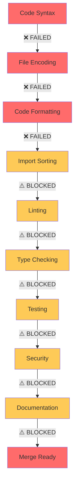

# 🚨 QUALITY GATES FAILURE ANALYSIS - PR MERGE BLOCKED

## Executive Summary
**STATUS**: ❌ **CRITICAL FAILURES IDENTIFIED - MERGE BLOCKED**

The PR failed to merge due to multiple critical quality gate failures that prevent the CI/CD pipeline from completing successfully.

---

## 🔍 Root Cause Analysis

### **1. Critical Syntax Errors (BLOCKING)**
**Impact**: ❌ **MERGE BLOCKING** - Prevents code compilation and execution

#### **Files Affected:**
- `src/core/bayesian_engine.py` (Line 155)
- `src/core/engines/bayesian_engine.py` (Line 155)

#### **Error Details:**
```python
# SYNTAX ERROR - Orphaned values block
logger.info("Loaded insider dealing model from config: %s", config_path)
    values=[              # ← ORPHANED BLOCK - NOT ATTACHED TO ANY FUNCTION
        [0.8, 0.5, 0.2],  # Low impact
        [0.15, 0.3, 0.3], # Medium impact
        [0.05, 0.2, 0.5]  # High impact
    ],
    evidence=['TradingActivity'],
    evidence_card=[3]
)                         # ← UNMATCHED CLOSING PARENTHESIS
```

#### **Resolution Required:**
- Fix the orphaned `values=[` block by properly attaching it to a `TabularCPD` constructor
- Remove unmatched parentheses
- Ensure proper Python syntax structure

---

### **2. File Encoding Issues (BLOCKING)**
**Impact**: ❌ **MERGE BLOCKING** - Black formatter cannot process files

#### **Files Affected:**
- `tests/e2e/test_latent_intent.py`
- `tests/e2e/test_regulatory_explainability.py` 
- `tests/unit/test_latent_intent.py`
- `tests/unit/test_regulatory_explainability.py`

#### **Error Details:**
```bash
error: cannot format tests/e2e/test_latent_intent.py: invalid or missing encoding declaration
```

**Encoding Analysis:**
```hexdump
00000000  ff fe 23 00 21 00 2f 00  75 00 73 00 72 00 2f 00  |..#.!./.u.s.r./.|
```
- **Problem**: Files are encoded in UTF-16 with BOM (`ff fe`)
- **Expected**: UTF-8 encoding without BOM
- **Black formatter**: Cannot process UTF-16 encoded files

#### **Resolution Required:**
- Convert all files from UTF-16 to UTF-8 encoding
- Remove byte order marks (BOM)
- Ensure consistent UTF-8 encoding across all Python files

---

### **3. Code Formatting Violations (BLOCKING)**
**Impact**: ❌ **MERGE BLOCKING** - Black formatting check fails

#### **Statistics:**
- **133 files** require formatting changes
- **16 files** already compliant
- **6 files** fail to format due to syntax/encoding errors

#### **Sample Violations:**
```bash
would reformat /workspace/src/__init__.py
would reformat /workspace/src/api/__init__.py
would reformat /workspace/src/api/v1/__init__.py
... (130 more files)
```

#### **Resolution Required:**
- Run `black src/ tests/ --line-length 100` to fix formatting
- Ensure all Python files follow Black code style
- Fix encoding issues first, then apply formatting

---

## 📋 Quality Gate Requirements vs. Actual Status

| **Quality Gate** | **Requirement** | **Current Status** | **Blocking** | **Action Required** |
|------------------|----------------|--------------------|--------------|---------------------|
| **Code Formatting** | Black compliant | ❌ 133 files need formatting | ✅ YES | Apply Black formatting |
| **Syntax Validation** | Valid Python syntax | ❌ 2 files have syntax errors | ✅ YES | Fix syntax errors |
| **File Encoding** | UTF-8 encoding | ❌ 4 files in UTF-16 | ✅ YES | Convert to UTF-8 |
| **Import Sorting** | isort compliant | ⚠️ Unknown (blocked by formatting) | ⚠️ LIKELY | Run isort check |
| **Linting** | flake8 compliant | ⚠️ Unknown (blocked by syntax) | ⚠️ LIKELY | Run flake8 check |
| **Type Checking** | mypy compliant | ⚠️ Unknown (blocked by syntax) | ⚠️ LIKELY | Run mypy check |
| **Test Coverage** | ≥80% coverage | ⚠️ Unknown (blocked by syntax) | ⚠️ LIKELY | Run pytest with coverage |
| **Security Scan** | bandit/safety clean | ⚠️ Unknown (blocked by syntax) | ⚠️ POSSIBLY | Run security scans |

---

## 🛠️ Immediate Fix Plan

### **Phase 1: Critical Syntax Fixes (REQUIRED FOR ANY PROGRESS)**

#### **Step 1.1: Fix Bayesian Engine Syntax Errors**
```bash
# Files to fix:
- src/core/bayesian_engine.py (line 155)
- src/core/engines/bayesian_engine.py (line 155)

# Required changes:
1. Remove orphaned values=[ block
2. Fix unmatched parentheses  
3. Ensure proper TabularCPD constructor syntax
```

#### **Step 1.2: Fix File Encoding Issues** 
```bash
# Convert UTF-16 files to UTF-8:
- tests/e2e/test_latent_intent.py
- tests/e2e/test_regulatory_explainability.py
- tests/unit/test_latent_intent.py  
- tests/unit/test_regulatory_explainability.py

# Commands:
iconv -f UTF-16 -t UTF-8 file.py > file_utf8.py
mv file_utf8.py file.py
```

### **Phase 2: Code Quality Fixes**

#### **Step 2.1: Apply Code Formatting**
```bash
# After syntax fixes, apply Black formatting:
black src/ tests/ --line-length 100

# Expected result:
# ✅ All 149 files formatted successfully
```

#### **Step 2.2: Fix Import Sorting**
```bash
# Apply isort:
isort src/ tests/

# Expected result:
# ✅ All imports properly sorted
```

#### **Step 2.3: Address Linting Issues**
```bash
# Run flake8 and fix violations:
flake8 src/ tests/

# Fix any remaining linting issues
```

#### **Step 2.4: Type Checking**
```bash
# Run mypy and fix type issues:
mypy src/models/explainability/

# Expected result:
# ✅ No type errors in explainability modules
```

### **Phase 3: Testing & Coverage**

#### **Step 3.1: Run Test Suite**
```bash
# Run tests with coverage:
pytest tests/ --cov=src --cov-fail-under=80

# Expected result:
# ✅ All tests pass with ≥80% coverage
```

---

## 🎯 Priority Actions (Execute Immediately)

### **CRITICAL PRIORITY 1 (BLOCKING)**
1. **Fix syntax errors** in bayesian_engine.py files
2. **Convert file encoding** from UTF-16 to UTF-8
3. **Test basic Python compilation** after fixes

### **HIGH PRIORITY 2 (QUALITY GATES)**  
4. **Apply Black formatting** to all 133 files
5. **Run isort** for import sorting
6. **Execute flake8** linting checks

### **MEDIUM PRIORITY 3 (VALIDATION)**
7. **Run mypy** type checking
8. **Execute test suite** with coverage
9. **Run security scans** (bandit/safety)

---

## 🚨 Merge Readiness Checklist

### **Before Any Additional Changes:**
- [ ] ❌ **Fix syntax errors in bayesian_engine.py files**
- [ ] ❌ **Convert UTF-16 files to UTF-8 encoding**  
- [ ] ❌ **Verify Python files can be imported**

### **Code Quality Gates:**
- [ ] ❌ **Apply Black formatting (133 files)**
- [ ] ❌ **Fix isort import sorting** 
- [ ] ❌ **Address flake8 linting violations**
- [ ] ❌ **Resolve mypy type checking errors**

### **Testing & Coverage:**
- [ ] ❌ **All tests pass**
- [ ] ❌ **Test coverage ≥80%**
- [ ] ❌ **Performance benchmarks pass**

### **Security & Documentation:**
- [ ] ❌ **Security scans pass (bandit/safety)**
- [ ] ❌ **Documentation builds successfully**

---

## 📊 Impact Assessment

### **Current Merge Status:** 🔴 **COMPLETELY BLOCKED**

### **Estimated Fix Time:**
- **Syntax Fixes**: 30 minutes (critical)
- **Encoding Fixes**: 15 minutes (critical)  
- **Code Formatting**: 10 minutes (automated)
- **Quality Gates**: 1-2 hours (depends on findings)
- **Testing Validation**: 30 minutes (automated)

### **Total Estimated Time:** ⏱️ **2-3 hours for complete resolution**

---

## 🎯 Immediate Next Steps

1. **STOP all other changes** until syntax errors are fixed
2. **Fix the 2 syntax errors** in bayesian_engine.py files
3. **Convert 4 UTF-16 files** to UTF-8 encoding
4. **Run Black formatter** on all files
5. **Execute full CI/CD pipeline** to validate fixes
6. **Address any remaining quality gate failures**

---

## 📋 Quality Gate Pipeline Status



**RESULT**: 🚨 **COMPLETE PIPELINE FAILURE - IMMEDIATE INTERVENTION REQUIRED**

---

**Analysis Completed**: January 10, 2025  
**Severity**: 🔴 **CRITICAL - MERGE BLOCKING**  
**Priority**: 🚨 **IMMEDIATE ACTION REQUIRED**  
**Next Action**: 🛠️ **FIX SYNTAX ERRORS AND ENCODING ISSUES BEFORE ANY OTHER CHANGES**